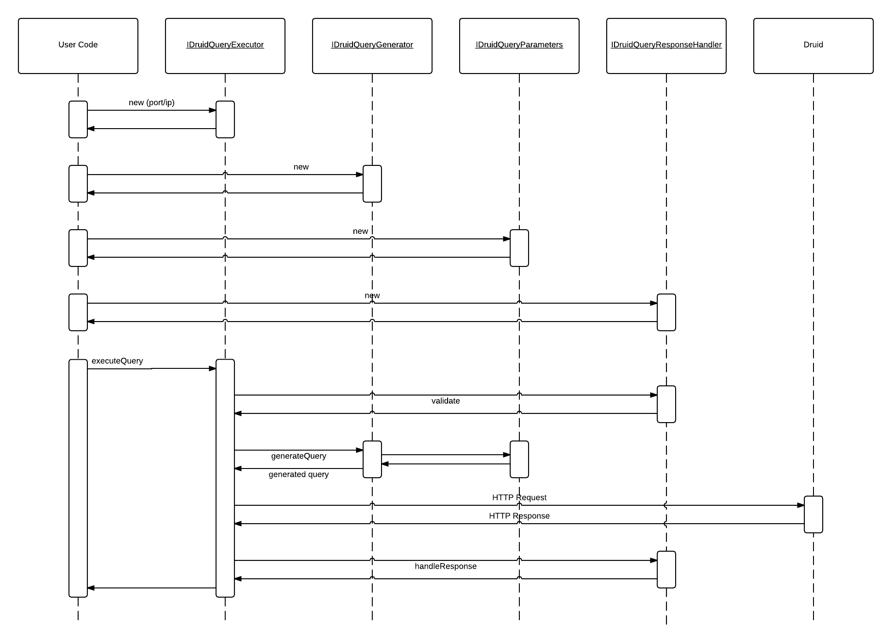

php-druid-query
===============

PHP wrapper around executing HTTP requests to [Druid](http://druid.io). Usually this will be for queries, but can be
used for other purposes (such as [ingestion](https://github.com/r4j4h/php-druid-ingest)).


Overview
---------------

The wrapper lives in the namespace `DruidFamiliar`. Druid itself was named in the sprit of the D&D character, and that
character could have a familiar - a spiritually linked animal companion. This wrapper in a sense lives as a companion to
Druid, and thus the name.

I think the repo name should reflect the namespace for clarity, it currently is `php-druid-query` while
the namespace is `DruidFamiliar`. This would be pretty breaking change and will be saved for the future. If you have
other suggestions for naming of project or namespaces, feel free to suggest before then.


[Changelog](https://github.com/r4j4h/php-druid-query/releases)


Typical Use
---------------

In general, this wrapper's purpose is to streamline the execution of queries by encapsulating the cruft from the `HTTP` nature of Druid and the analytical grammar in query configuration.

1. Instantiate a connection, configured to hit a Druid endpoint.
2. Instantiate a query generator object for the desired query.
3. Instantiate a query parameters object, configured with desired query parameters.
4. Instantiate a result handler to format the results (otherwise use `DoNothingResponseHandler`)
5. Combine the connection, query, parameters, and response handler to execute it, getting the result from the result handler.

Interface wise, this looks like:

1. Instantiate a `IDruidQueryExecutor`, configured to hit a Druid endpoint.
2. Instantiate a `IDruidQueryGenerator`.
3. Instantiate a `IDruidQueryParameters`, configured with parameters.
4. Instantiate a `IDruidQueryResponseHandler`.
5. Run the `IDruidQueryExecutor`'s `executeQuery` function with the `IDruidQueryGenerator`, `IDruidQueryParameters`, and the `IDruidQueryResponseHandler`, getting the result from the `IDruidQueryResponseHandler`.

Implementation wise, this can look like:

1. Instantiate a `DruidNodeDruidQueryExecutor`, configured to hit a Druid endpoint.
2. Instantiate a `SegmentMetadataDruidQuery`.
3. Instantiate a `SegmentMetadataDruidQueryParameters`, configured with parameters.
4. Instantiate a `SegmentMetadataResponseHandler`.
5. Run the `DruidNodeDruidQueryExecutor`'s `executeQuery` function with the classes spawned in the previous steps, getting the result from `SegmentMetadataResponseHandler`.


How to Install
---------------

Right now, there is no tagged version. To be ready for it when it comes, branch-aliases are in place.

- Stable branch: `~1.0@dev`
- Cutting edge: `~1.1@dev`


To install, it is suggested to use [Composer](http://getcomposer.org). If you have it installed, then the following instructions
in a composer.json should be all you need to get started:

```json
{
    "require": {
        "r4j4h/php-druid-query": "~1.0@dev"
    }
}
```

Once that is in, `composer install` and `composer update` should work.

Once those are run, require Composer's autoloader and you are off to the races, or tree circles as it were (bad Druid reference):

1. `require 'vendor/autoload.php';`
2. `$yay = new \DruidFamiliar\Query\TimeBoundaryDruidQuery('my-cool-data-source');`
3. Refer to the [Typical Use](#typical-use) section above.


How to Test
-------------

Once `composer install` has finished, from the root directory in a command terminal run:

`vendor/bin/phing`

or

`vendor/bin/phpunit tests`


Generate Documentation
-------------

From the root directory, in a command terminal run: `php vendor/bin/phing docs`.


Examples
---------------

Examples are located in the [\examples](examples) folder.

They share connection information from `_examples-config.php`.
Change that match your Druid instance's connection info.

Right now most are designed to run via the CLI, but will work in a browser if a web server running php serves them.

The HTML outputting ones should print the query results to HTML:


How it Works & How to Extend
---------------

Please refer to this diagram for an overview of how this works underneath the hood.



(From this [Dynamic LucidChart Source URL](https://www.lucidchart.com/publicSegments/view/542c92a6-f14c-4520-b004-04920a00caaf/image.png))

In general, to add support for a new query all you need to do is create a new class wherever you want that implements `IDruidQuery`.

By wherever you want, that could be in a fork of this repo, or outside of this repo using this repo's interfaces. That is up to you. :)


References
---------------

- [Druid](http://druid.io)
- [Composer](http://getcomposer.org)
- [Guzzle](http://guzzle.readthedocs.org)


Appendix A. Composer.json example that does not rely on Packagist.org:
---------------

```json
{
    "repositories": [
        {
            "type": "vcs",
            "url": "git@github.com:r4j4h/php-druid-query"
        }
    ],
    "require": {
        "r4j4h/php-druid-query": "~1.0@dev"
    }
}
```
